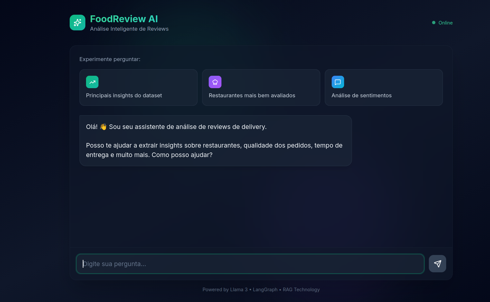

# 🍔 FoodReview Insights Agent

<div align="center">

[](./README.md)


**An Autonomous AI Agent capable of extracting strategic insights from unstructured customer reviews.**

<br />
<br />



<br />
<br />


</div>

---

## 🚀 About the Project

Built as a portfolio project for the **GenAI Engineering** track, this application simulates an intelligent analyst for restaurant owners.

Unlike simple RAG systems, this agent uses a **Reasoning Engine (ReAct)** powered by **LangGraph** to:
1.  **Understand Context:** Interprets complex queries in natural language (PT-BR).
2.  **Tool Use:** Decides when to query the Vector Database vs. using general knowledge.
3.  **Handle Noisy Data:** Analyzes sentiment from realistic, messy reviews (slang, typos, caps lock) generated by a custom Synthetic Data Pipeline.

### 🏗️ Architecture

* **Brain:** Llama 3.3 70B (via Groq API)
* **Orchestration:** LangGraph (State-of-the-art agentic framework)
* **Memory (RAG):** ChromaDB + HuggingFace Embeddings (`all-MiniLM-L6-v2`)
* **Backend:** FastAPI (Python)
* **Frontend:** Next.js 15 + Tailwind CSS (Cyberpunk Terminal UI)
* **Data Engineering:** Synthetic Data Pipeline simulating Brazilian delivery scenarios.

---

## 🛠️ How to Run Locally

### 1. Clone and Setup
```bash
git clone https://github.com/josevbrito/food-review-agent.git
cd food-review-agent

# Create Virtual Environment
python3 -m venv .venv
source .venv/bin/activate  # Windows: .venv\Scripts\activate

# Install Dependencies
pip install -r backend/requirements.txt
````

### 2\. Configure Environment

Create a `backend/.env` file based on `backend/.env.example`:

```ini
GROQ_API_KEY=gsk_your_key_here
```

### 3\. Generate Data & Start Backend

This script will generate fresh synthetic data using Llama 3 (simulating "angry customers", "gen z", etc.) and populate the Vector DB.

```bash
# From project root
cd backend
python app/scripts/generate_synthetic_data.py
uvicorn app.main:app --reload
```

### 4\. Start Frontend

Open a new terminal:

```bash
cd frontend
npm install
npm run dev
```

Access the terminal interface at `http://localhost:3000`.

-----

## 🧪 Testing the Agent

Try asking these questions to test the agent's reasoning capabilities:

  * *"O que falam sobre a entrega?"* (Sentiment Analysis)
  * *"Tem reclamações sobre o Sushi?"* (Specific Retrieval)
  * *"O pessoal está bravo?"* (Context understanding of "Caps Lock" and slang)

-----

## 👨‍💻 Author

**José Victor Brito Costa**
* Software Engineer & Data Scientist
* Focus: LLMOps, Agents, and Full Stack Development.

<div align="left"> 
  <a href="https://josevbrito.com" target="_blank">
    
  </a>
  <a href="https://www.linkedin.com/in/josevbrito" target="_blank">
    
  </a>
</div>

<br />

> **If this project helped you or you liked the architecture, please give it a ⭐️ on GitHub!**